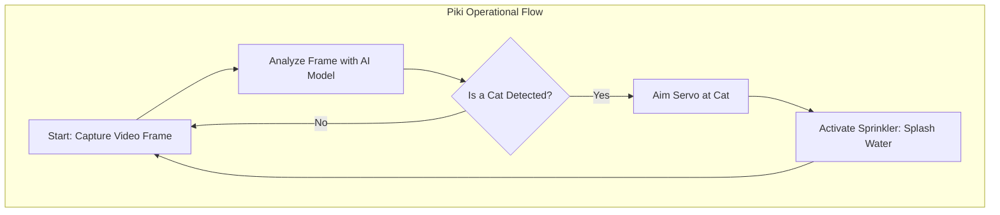

# Piki: An AI-Powered Cat Deterrent System

## 1. Management Summary

### The Problem
Neighborhood cats frequently enter our garden, using it as a litter box. This creates an unsanitary environment and poses a significant health risk, especially for babies and small children who play in the garden. Cat feces can transmit harmful parasites and bacteria, making a clean and safe outdoor space a top priority.

### Our Solution
**Piki** is an autonomous, humane, and cost-effective system designed to solve this problem. Using a low-cost single-board computer and a camera, Piki employs real-time object detection to identify cats as soon as they enter a monitored area. Upon detection, the system is designed to trigger a harmless deterrent, such as a brief spray from a water sprinkler or an ultrasonic sound, effectively training cats to avoid the area without causing them any harm. This "do-it-yourself" project provides a complete blueprint for building an intelligent and reliable cat deterrent, managed through a simple web interface.

---

## 2. Technical Details

### Hardware Setup

The system is built with accessible and affordable components. Please note the specific processor requirement for full performance.

**Core Components:**
*   **Single-Board Computer (SBC):** The core of the system. For full performance with Neural Processing Unit (NPU) acceleration, a board with a **Rockchip RK3566 or RK3568** processor is required. This is because the provided AI model has been specifically converted to the `.rknn` format for this hardware target.
    *   *Recommended boards:* Orange Pi 3B, Radxa Zero 3W.
    *   Other SBCs like the Raspberry Pi can run the system in a CPU-only mode, but without the performance benefits of NPU acceleration.
*   **Camera Module:** A compatible camera (e.g., Raspberry Pi Camera Module) to provide the video feed for detection.
*   **Servo Motor:** An angular servo to allow the camera to pan and cover a wider area of the garden.
*   **Power Supply:** A stable power source for the SBC and connected components.
*   **(Optional) Deterrent Mechanism:** A relay-controlled water valve, ultrasonic speaker, or other device to be triggered upon detection.

### Software Architecture & Dependencies

The project relies on a lightweight yet powerful software stack, optimized for performance on resource-constrained devices. The system is managed through a built-in web application.

**Key Dependencies:**
*   **gpiozero & pigpio:** Python libraries for easy and precise control of the servo motor.
*   **numpy:** A fundamental package for numerical computation, used for handling image data.
*   **opencv-contrib-python-headless:** Provides computer vision algorithms for image processing.
*   **rich:** A library for beautiful formatting in the terminal for logging and status updates.
*   **rknn-toolkit-lite2:** Enables hardware acceleration for the AI model on Rockchip NPUs.
*   **django / flask:** Web frameworks used to build the web-based graphical user interface (GUI).

### Visual Workflow

The operational flow of the Piki system is straightforward: capture, analyze, and act. The following diagram illustrates the complete operational sequence.



---

## 3. Installation & Setup

This project supports multiple hardware platforms. Please follow the instructions relevant to your device.

### A. Raspberry Pi Setup (CPU-Only)

#### Servo Control
1.  **Install Dependencies:**
    ```bash
    sudo apt install pigpio python3-pigpio
    uv add gpiozero pigpio
    ```
2.  **Start GPIO Daemon:**
    ```bash
    sudo gpiod
    ```

#### Camera (Picamera2)
1.  **Install System Packages:**
    ```bash
    sudo apt update
    sudo apt install -y python3-picamera2 rpicam-apps-lite libcamera-dev python3-libcamera --no-install-recommends
    ```
2.  **Add to your Python environment:**
    ```bash
    # Make sure to use a virtual environment with --system-site-packages
    uv venv --system-site-packages
    source .venv/bin/activate
    uv add picamera2
    ```
3.  **Enable Camera:** For specific camera modules (like the OV5647), you may need to edit `/boot/firmware/config.txt`:
    ```ini
    camera_auto_detect=0
    dtoverlay=ov5647
    ```

### B. Orange Pi / Radxa Zero Setup (with NPU Acceleration)

For leveraging the NPU on boards with a Rockchip RK3566/RK3568 processor, the setup is more involved and requires installing specific drivers and libraries (like RKNN).

*Detailed instructions for **Orange Pi 3B** and **Radxa Zero 3W** are available in the repository's full documentation.*

---

## 4. Usage: The Web Interface

The entire Piki system is designed to be controlled and monitored through a simple web-based Graphical User Interface (GUI).

### Starting the Application
1.  Navigate to the source directory:
    ```bash
    cd src/piki
    ```
2.  Execute the run script. This will start the web server and the object detection service.
    ```bash
    ./run.sh
    ```

### Accessing the GUI
1.  Once the server is running, open a web browser on any device connected to the same network (your computer, phone, or tablet).
2.  Navigate to the IP address of your board. For example: `http://192.168.1.123`

From the web interface, you can:
*   **View the live camera feed** to ensure it's aimed correctly.
*   **Monitor system status** and see logs of recent detections.
*   **Fine-tune settings** for detection sensitivity and deterrent activation.
*   **Manually control** the system components for testing.